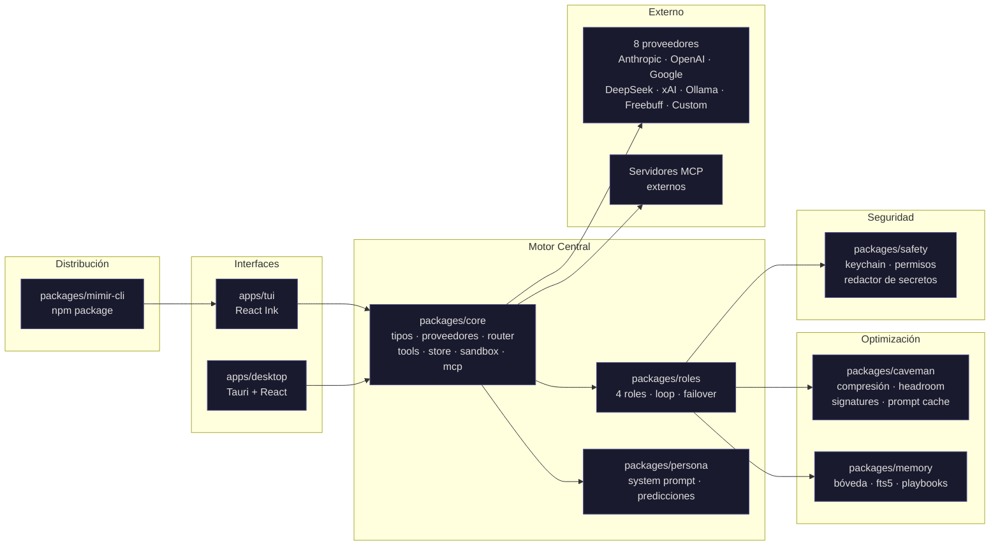

# Mímir el Necio — Documentación Completa

**Versión:** 1.0.6  
**Autor:** Uriel Gomez Becerril [@UreckChan](https://github.com/UreckChan)  
**Repositorio privado:** [`UreckChan/mimir`](https://github.com/UreckChan/mimir) — monorepo con 7 packages + 2 apps  
**Repositorio público:** [`UreckChan/mimir-cli`](https://github.com/UreckChan/mimir-cli) — wrapper npm + binarios  
**Package npm:** [`mimir-cli`](https://www.npmjs.com/package/mimir-cli)  
**Docs site:** https://ureckchan.github.io/mimir-cli/  
**Licencia:** MIT

---

## Novedades v1.0.6

- **Modelo y credencial por rol.** Cada rol (Arquitecto/Albañil/Inspector/Cronista) puede usar un proveedor+modelo distinto y elegir de dónde salen sus credenciales: **API key**, **suscripción** (vía la CLI de la terminal: Claude Pro→Claude Code, ChatGPT→Codex), o mixto. Los modelos se filtran a los compatibles con la terminal elegida. Configurable desde Ajustes → "Modelos por rol".
- **Fases del protocolo configurables.** Activa/desactiva por separado **Plan / Desarrollo / Revisión / Aprendizaje**. Cualquier combinación; Revisión off = se asume aprobado; sin ninguna fase = respuesta directa (modo chat), respetando la compresión caveman.
- **Gate de aprobación del plan.** Dos modos: **Auto** (corre solo) o **Con aprobación** — tras la fase Plan, Mímir guarda el plan como `.md` (agrupado por chat en `~/.elcuartohombre/plans/<chat>/`), lo muestra, y no avanza a Desarrollo hasta que lo apruebes; puedes pedir cambios las veces necesarias (re-planea con tu feedback). En modo nocturno se auto-aprueba.
- **Personalidad separada de la función.** El tono "El Cuarto Hombre" es ahora un solo toggle (**OFF por default**) que solo cambia cómo redacta — no toca las fases ni lo que hace.
- **Contexto entre cambios de agente.** Un preámbulo compacto con el estado de la sesión viaja entre roles/fases para no perder el hilo al cambiar de agente/modelo, con trazabilidad persistida.
- **Estados por rol en vivo** (idle / working / blocked / done) en el panel del loop.
- **Sesión persistente + reattach.** El loop corre en el sidecar y sobrevive al cierre del cliente: la sesión se guarda en disco y puedes reconectar desde otra ventana y retomar el estado.

---

## Índice

1. [¿Qué es Mímir?](#1-qué-es-mímir)
2. [¿Para qué sirve?](#2-para-qué-sirve)
3. [Deficiencias que resuelve](#3-deficiencias-que-resuelve)
4. [Compresión de tokens y ahorro de contexto](#4-compresión-de-tokens-y-ahorro-de-contexto)
5. [Herramientas y capacidades](#5-herramientas-y-capacidades)
6. [Arquitectura](#6-arquitectura)
7. [Proveedores y modelos](#7-proveedores-y-modelos)
8. [Seguridad](#8-seguridad)
9. [Interfaces](#9-interfaces)

---

## 1. ¿Qué es Mímir?

Mímir es un **agente autónomo de código** con 4 roles internos (Arquitecto, Albañil, Inspector, Cronista) que ejecuta proyectos completos en un loop **PLAN → STEP → VERIFY → LEARN** sin supervisión humana.

No es un plugin, no es un complemento, no es un chatbot. Es un **entorno de trabajo standalone** que:

- Toma un objetivo en lenguaje natural
- Explora el código existente
- Planea los pasos necesarios
- Escribe el código, corre comandos e instala dependencias
- Verifica que funcione (tests, build, lint, o Playwright para apps web)
- Guarda la lección aprendida para la próxima vez
- Reporta el resultado sin rodeos

El nombre viene de **Mímir**, el dios nórdico de la sabiduría que bebe del pozo del conocimiento. "El Necio" es un recordatorio de que la honestidad brutal vale más que la cortesía técnica.

### Stack tecnológico

| Capa | Tecnología |
|---|---|
| Runtime | **Bun** — binario único por plataforma con `bun build --compile` |
| Multi-modelo | **Vercel AI SDK v7** — Anthropic, OpenAI, Google, DeepSeek, xAI, Ollama, Freebuff |
| Desktop | **Tauri v2** + React + Vite (webview del sistema, sin Electron) |
| TUI | **React Ink** sobre Bun |
| Persistencia | **bun:sqlite** con FTS5 |
| Streaming | `streamText` con tokens en vivo |
| Bundles | macOS arm64, Linux x64, Windows x64 |

---

## 2. ¿Para qué sirve?

### Modo Chat (sin proyecto)

Escribe un mensaje directo. Mímir responde como asistente conversacional con stream de tokens en vivo. Sin loop de roles, sin sidecar. Ideal para preguntas rápidas, debugging o exploración.

### Modo Proyecto (con directorio)

Selecciona un directorio, escribe un objetivo, y Mímir ejecuta el loop completo:

1. **▲ Arquitecto** — explora el código, diseña la estrategia, produce un checklist
2. **■ Albañil** — escribe código, corre comandos, instala dependencias (un paso a la vez)
3. **◆ Inspector** — revisa el trabajo con ojo crítico, corre tests/build/lint, da veredicto
4. **● Cronista** — resume lo aprendido y lo guarda en la bóveda de memoria

### Casos de uso concretos

- **Refactorizar** una base de código existente sin romper nada
- **Agregar una feature** a un proyecto (API, CRUD, migración, tests)
- **Debuggear** un bug intermitente — el loop explora, hipotetiza, prueba, descarta
- **Crear un proyecto desde cero** con todas las dependencias y configuración
- **Migrar** entre versiones de frameworks o librerías
- **Auditar** seguridad, estilo, o cobertura de tests
- **Automatizar** tareas repetitivas de mantenimiento

### mimir-cli — Package npm

Mímir se distribuye también como **package npm** ([`mimir-cli`](https://www.npmjs.com/package/mimir-cli)) que funciona como wrapper ligero (~3.5 kB):

1. Detecta la plataforma (macOS arm64, Linux x64, Windows x64)
2. Descarga el binario TUI compilado desde `https://github.com/UreckChan/mimir-cli/releases/download/v1.0.4/mimir-{platform}`
3. Lo guarda en `~/.mimir/bin/`
4. Lo ejecuta con los argumentos que recibe

Los binarios reales (65–98 MB cada uno) **no están en npm** — se descargan en el primer uso desde el repositorio público [`UreckChan/mimir-cli`](https://github.com/UreckChan/mimir-cli). El repositorio privado [`UreckChan/mimir`](https://github.com/UreckChan/mimir) contiene el monorepo completo con todos los packages y apps.

```bash
# Instalar
npm install -g mimir-cli

# Usar
mimir --goal "haz X"
```

### Modos de operación

| Modo | Descripción |
|---|---|
| **Chat** | Respuesta conversacional directa, sin loop |
| **Plan** | Loop completo con plan detallado del Arquitecto |
| **Build** | Loop optimizado para codificar (menos planeación, más ejecución) |
| **Nocturno** | Cola de metas encadenadas, corre sin supervisión, notifica al terminar |

---

## 3. Deficiencias que resuelve

### 3.1 Costo de modelos — router inteligente por dificultad

**Problema:** Usar el modelo más caro para cada paso del flujo de desarrollo es prohibitivo. Clasificar archivos, resumir logs, o escribir código repetitivo no necesita un modelo de $25/MTok.

**Solución:** Mímir clasifica cada paso del loop y lo enruta al modelo más barato capaz de hacerlo:

| Tier | Cuándo se usa | Costo típico | Modelo ejemplo |
|---|---|---|---|
| **Free** | Clasificar, resumir, comprimir, cronista | $0 | Ollama local (Qwen3, Llama 3.3, etc.) o Freebuff |
| **Cheap** | Código rutinario, debugging simple, tool execution | $0.15–$1.50/MTok | DeepSeek v4 Flash, GPT-5.6 Luna, Grok 4.5 |
| **Top** | Arquitectura, bugs complejos, revisión de seguridad | $3–$5/MTok | Claude Opus 4.8, GPT-5.6 Sol, Gemini 3.1 Pro |

El usuario define un **presupuesto en USD por meta** y el router corta automáticamente al alcanzarlo. El gasto se reporta en vivo y se desglosa por proveedor y por rol.

### 3.2 Failover automático entre proveedores

**Problema:** Rate limits, caídas de API, o cuotas agotadas interrumpen el flujo de trabajo.

**Solución:** Priority List — lista ordenada de modelos con failover automático. Si el primero falla (rate limit, sin API key, error de red, cuota), pasa al siguiente sin detener el trabajo. El failover se notifica como evento en vivo en la UI.

Ejemplo de priority list:
```
1. anthropic/claude-sonnet-5    (cloud, requiere API key)
2. deepseek/deepseek-v4-flash   (cloud, requiere API key propia)
3. ollama/llama3.2:3b           (local, gratis si Ollama está corriendo)
```

### 3.3 Contexto desperdiciado — tres capas de compresión

**Problema:** Los tool outputs (especialmente `read`, `glob`, `bash`) son enormes y consumen contexto valioso del modelo. Los mensajes del modelo también incluyen relleno innecesario.

**Solución:** Tres mecanismos complementarios documentados en detalle en la [Sección 4](#4-compresión-de-tokens-y-ahorro-de-contexto).

### 3.4 Memoria frágil — cada sesión empieza en blanco

**Problema:** Los asistentes de IA no recuerdan nada entre sesiones. Cada error que ya se resolvió se resuelve desde cero.

**Solución:** Bóveda persistente estilo Alexandria/Obsidian con:
- Notas markdown con [[wikilinks]] y FTS5
- Captura automática de lecciones al cerrar cada meta
- Anti-repetición: si repites un error ya documentado, Mímir lo saca con fecha y receipts
- Destilador de playbooks: al cerrar una meta, convierte lo aprendido en pasos reutilizables

### 3.5 Trabajo manual en el loop — el inspector es adversarial de verdad

**Problema:** La mayoría de agentes "autónomos" solo ejecutan código y confían en que funcione. No verifican, no critican, no corrigen.

**Solución:** El Inspector es un **agente adversarial real** que corre con OTRO modelo (usualmente el tier "top") y revisa el trabajo del Albañil con honestidad brutal. Corre tests, lee el diff, busca huecos de seguridad, inconsistencias y errores. Su veredicto es explícito: `VEREDICTO: APRUEBA` o `VEREDICTO: RECHAZA: <razón concreta>`. No hay falsas aprobaciones.

### 3.6 Riesgo de comandos destructivos — permisos granulares

**Problema:** Un agente autónomo con acceso a `rm -rf`, `DROP TABLE`, o `force-push` puede causar daños catastróficos.

**Solución:** Tres niveles de permiso (paranoico / normal / yolo) con lista blanca de comandos por nivel. Comandos destructivos pasan por confirmación humana explícita antes de ejecutarse. Las API keys se redactan de los tool outputs — el modelo nunca las ve.

### 3.7 Sin rollback — errores difíciles de deshacer

**Problema:** Si el agente da 5 pasos y el paso 3 está mal, hay que revertir manualmente.

**Solución:** Cada meta corre en un **git worktree aislado**. Cada paso del loop se puede "sellar" con `snapshot()`. Si el agente la caga en el paso 7, `revert(3)` regresa 3 snapshots atrás. Los cambios solo se fusionan a la rama real tras la aprobación del Inspector.

### 3.8 Dependencia de un solo proveedor

**Problema:** Estar atado a un solo modelo/proveedor limita flexibilidad, precios y disponibilidad.

**Solución:** 8 proveedores soportados: Anthropic, OpenAI, Google, DeepSeek, xAI, Ollama, Freebuff, y endpoint custom OpenAI-compatible. Cambio de modelo en caliente a media sesión. Cada rol puede correr con un modelo distinto.

### 3.9 Honestidad sin calibración

**Problema:** Escuchar "esto está mal" de un agente sin historial de aciertos no es útil. Es ruido.

**Solución:** Contador "Te-lo-dije": cada predicción técnica fuerte se registra. Cuando se confirma o no, el sistema lo sabe. Con el tiempo, la honestidad de Mímir tiene **receipts** — cuando dice "estás pendejo", trae historial de predicciones acertadas.

---

## 4. Compresión de tokens y ahorro de contexto

Mímir implementa **tres capas de compresión** que atacan las dos fuentes de gasto: la entrada (contexto que se envía al modelo) y la salida (respuestas del modelo).

### 4.1 Compresión de salida (Caveman)

Paquete: `packages/caveman` — comprime las respuestas del modelo antes de mostrarlas al usuario. Nunca toca código, errores, paths ni decisiones de seguridad.

| Nivel | Qué hace | Ahorro típico |
|---|---|---|
| **lite** | Elimina relleno (filler phrases), hedging, y cortesía corporativa. Mantiene artículos/estructura. | ~40% |
| **full** | Elimina artículos, conectores reemplazados por `→`, frases fragmentadas, una idea por línea. | ~65% |
| **ultra** | Todo lo anterior + diccionario de abreviaciones (DB/auth/config/req/res/fn/impl). | ~80% |

**Auto-clarity:** Si el texto contiene advertencias de seguridad, operaciones destructivas o secuencias críticas, la compresión se desactiva automáticamente — ahí habla claro sin abreviar.

**Implementación:**
```typescript
// packages/caveman/src/compress.ts
export function compressOutput(text: string, level: "lite" | "full" | "ultra"): CompressResult
```

Proceso:
1. Extrae bloques de código (```) y los guarda aparte intactos
2. Aplica regex de filler phrases (por favor, me complace, estimado, etc.)
3. En full/ultra: elimina artículos (el/la/los/un/una) y conectores (porque/entonces/sin embargo)
4. En ultra: aplica diccionario de abreviaciones
5. Restaura bloques de código intactos

### 4.2 Compresión de tool outputs (Headroom)

Paquete: `packages/caveman/src/headroom.ts` — comprime las salidas de herramientas (read, glob, bash) que son la principal fuente de consumo de contexto. Se activa con el flag "Headroom" en Settings.

**Modo JSON-aware:**
- Arrays > 20 items se truncan: `[... 20 items ... "50 items más omitidos"]`
- Strings > 500 chars dentro del JSON se truncan: `"... 300 caracteres más omitidos"`
- El original completo se guarda en un `OriginalStore` accesible via tool `recall()`

**Modo texto plano:**
- Strings > 3000 chars se truncan: conserva primeras 40 líneas + últimas 40 líneas
- Marca: `[headroom: comprimido de 15000 a 2800 caracteres. Original: recall({ ref: "abc123" }).]`

**Resultado:** Tool outputs que antes ocupaban 15,000 caracteres ahora ocupan ~2,500. El modelo puede pedir el original completo si lo necesita.

### 4.3 Compresión de entrada (Context)

Paquete: `packages/caveman/src/context.ts` — comprime la memoria/lecciones antes de inyectarlas al contexto del prompt, usando el mismo diccionario que Caveman ultra. Reduce el peso de la memoria inyectada en ~50%.

### 4.4 Lectura AST-aware (Signature extraction)

Paquete: `packages/caveman/src/signatures.ts` — extrae solo las **firmas** (definiciones de funciones/clases/interfaces) de los archivos de código en vez de leer cuerpos completos. Lee cuerpos completos solo cuando se van a editar.

Soporta 5 lenguajes: TypeScript, JavaScript, Python, Rust, Go.

**Impacto:** Leer un archivo TS de 500 líneas como firmas ocupa ~50 líneas (10%). El cuerpo completo se lee bajo demanda cuando el Albañil va a editarlo.

### 4.5 Prompt caching estructural

Paquete: `packages/caveman/src/prompt-cache.ts` — estructura el prompt en secciones estables (system prompt, tool definitions, instrucciones de rol) + volátiles (turno actual, contexto dinámico). Detecta si el hash de las secciones estables cambia entre llamadas — el error más común que mata el prompt caching en silencio.

**Impacto:** Hasta 90% de descuento en input tokens con proveedores que soportan prompt caching (Anthropic, DeepSeek, OpenAI).

### 4.6 Medidor en vivo (TokenMeter)

Paquete: `packages/caveman/src/meter.ts` — trackea en tiempo real:
- Caracteres originales vs comprimidos por Caveman
- Ratio de ahorro (savings ratio)
- Número de muestras procesadas
- Proyección de tokens ahorrados

Reporta eventos `compression.update` que la UI muestra en el panel de métricas.

### 4.7 Tabla de ahorros estimados

| Técnica | Ahorro en entrada | Ahorro en salida | Ahorro total estimado |
|---|---|---|---|
| Caveman (full) | — | ~60% | ~30% del total |
| Headroom | ~80% en tool outputs | — | ~25% del total (los tool outputs son lo más pesado) |
| Context compression | ~50% en memoria | — | ~5% del total (la memoria es inyectada) |
| AST-aware reading | ~90% en lectura inicial | — | ~15% del total (menos reads completos) |
| Prompt caching | ~90% en input tokens | — | ~50-70% del input (según proveedor) |
| **Total combinado*** | **~70-85%** | **~60%** | **~60-80% del costo total** |

*Nota: Los ahorros no son aditivos porque actúan sobre partes distintas del flujo y el prompt caching aplica solo a la parte estable del prompt.*

*\* AST-aware reading y prompt caching son **estimaciones teóricas** basadas en el diseño — no tienen telemetría en vivo implementada aún. Caveman y Headroom sí miden ahorros reales via `TokenMeter` en producción.*

---

## 5. Herramientas y capacidades

### 5.1 Tools del agente (packages/core/src/tools/)

El agente tiene 9 herramientas estándar que puede invocar en cualquier paso del loop:

| Tool | Archivo | Descripción |
|---|---|---|
| **read** | `tools/read.ts` | Lee archivos del proyecto. Soporta UTF-8, paths absolutos/relativos. |
| **write** | `tools/write.ts` | Escribe o sobrescribe archivos. Crea directorios padre si no existen. |
| **edit** | `tools/edit.ts` | Edita archivos existentes mediante str_replace. Detecta ambigüedad (múltiples coincidencias) y previene sobrescritura de texto no encontrado. |
| **bash** | `tools/bash.ts` | Ejecuta comandos en shell con timeout configurable. Output en vivo. |
| **glob** | `tools/glob.ts` | Busca archivos por patrón glob. Timeout de 10s integrado. |
| **grep** | `tools/grep.ts` | Búsqueda de texto con ripgrep en paralelo. Máximo 250 resultados. |
| **webfetch** | `tools/webfetch.ts` | Fetch a URLs externas. Timeout de 15s, límite de 50KB por respuesta. |
| **todo** | `tools/todo.ts` | Checklist persistente de pasos. Crea, completa y marca items. Sobrevive reinicios. |
| **terminal** | `tools/terminal.ts` | Tool Router — ejecuta comandos a través del mejor TerminalAdapter disponible (bash nativo, Claude Code, Codex, Aider, etc.). |

### 5.2 Terminal Adapters (packages/core/src/terminal-adapters/)

Mímir puede ejecutar comandos a través de diferentes terminales/CLIs además de bash nativo:

| Adaptador | Archivo | Requiere suscripción | Ecosistema |
|---|---|---|---|
| **Bash nativo** | — (built-in) | No | native |
| **Claude Code** | `claude-code.ts` | Sí (Claude Pro) | node |
| **Codex CLI** | `codex.ts` | Sí (Copilot) | node |
| **Gemini CLI** | `gemini.ts` | Sí | node |
| **OpenCode** | `opencode.ts` | No | node |
| **Goose** | `goose.ts` | No | node |
| **OpenHands** | `openhands.ts` | No | node |
| **Aider** | `aider.ts` | No | python |
| **Persistent Shell** | `persistent-shell.ts` | No | native |

El **ToolRouter** (`tool-router.ts`) elige automáticamente el mejor adaptador según:
- Lo que esté instalado en PATH
- Suscripciones activas del usuario
- Ecosistema del proyecto (package.json → Node, pyproject.toml → Python)
- Keywords en la meta del usuario
- Latencia de benchmark (elige el más rápido entre los disponibles)

### 5.3 Capacidades del sistema

#### Loop autónomo (PLAN → STEP → VERIFY → LEARN)

```
▲ Arquitecto → produce checklist con tool `todo`
■ Albañil   → ejecuta 1 paso del checklist a la vez
◆ Inspector  → revisa con modelo top, corre tests, da veredicto
● Cronista   → guarda lección en bóveda de memoria
```

#### Verificación multi-proyecto (`verify.ts`)

Detecta automáticamente el tipo de proyecto y corre los comandos de verificación correspondientes:

| Señal en el proyecto | Comando que corre |
|---|---|
| `package.json` + `bun.lock` | `bun test` |
| `package.json` + `pnpm-lock.yaml` | `pnpm test` |
| `package.json` + `yarn.lock` | `yarn test` |
| `package.json` (default) | `npm test` |
| `pyproject.toml` / `setup.py` / `requirements.txt` | `pytest` |
| `Cargo.toml` | `cargo test` |
| `go.mod` | `go test ./...` |

> **Nota:** La verificación con navegador real (Playwright) para apps web está planeada pero no implementada en v1. Por ahora el Inspector solo verifica tests/build/lint desde CLI.

#### Sandbox con rollback (`sandbox.ts`)

- `WorktreeSandbox.create()` — crea git worktree aislado para una meta
- `snapshot(label)` — sella el estado actual
- `revert(stepsBack)` — regresa N snapshots atrás
- `mergeInto(targetBranch)` — fusiona a rama real (solo tras aprobación del Inspector)
- `dispose()` — limpia el worktree

#### Memoria persistente (packages/memory/)

| Componente | Archivo | Descripción |
|---|---|---|
| **Vault** | `vault.ts` | Bóveda markdown con slugs, frontmatter, [[wikilinks]] y tipos de nota (lesson/session/plan/playbook/note) |
| **VaultIndex** | `vault-index.ts` | Índice SQLite FTS5 para búsqueda instantánea sobre notas |
| **MemoryVault** | `memory.ts` | Orquesta vault + índice: búsqueda, escritura, lectura |
| **Playbook** | `playbook.ts` | Destilador de lecciones en pasos reutilizables. Busca playbooks similares antes de resolver una meta |
| **Anti-repeat** | `anti-repeat.ts` | Detecta errores ya documentados y los restriega con fecha |
| **Frontmatter** | `frontmatter.ts` | Parseo/serialización de YAML frontmatter y wikilinks |

#### MCP (Model Context Protocol) (`mcp.ts`)

Soporte completo para servidores MCP externos como herramientas adicionales:

- `connectMcpServer(name, config)` — conecta a servidor stdio, HTTP o SSE
- `connectMcpServers(configs)` — conecta múltiples servidores en paralelo
- Prefija tools con `<nombreServidor>__` para evitar choques de nombres
- Cierra todas las conexiones con `close()`

### 5.4 Roles y su definición

| Rol | Tier | Modelo típico | Responsabilidad |
|---|---|---|---|
| **▲ Arquitecto** | top | Claude Opus / GPT-5.6 Sol | Planea estrategia, explora código, produce checklist. No escribe código ni corre comandos destructivos. |
| **■ Albañil** | cheap | DeepSeek v4 Flash / Claude Sonnet | Ejecuta un paso del checklist. Escribe código, corre comandos, instala dependencias. Si algo es más difícil de lo esperado, lo dice. |
| **◆ Inspector** | top | Claude Opus / GPT-5.6 Sol | Revisa el trabajo con ojo crítico. Corre tests, build, lint, lee el diff. Veredicto explícito: APRUEBA o RECHAZA con razón. |
| **● Cronista** | free | Ollama local (Qwen3, Llama) | Resume en 2–4 líneas qué se hizo, qué falló y qué se aprendió. Sin relleno. |

Cada rol tiene instrucciones específicas combinadas con la identidad de "El Cuarto Hombre" a través de `composeInstructions()`.

---

## 6. Arquitectura

```
Mímir/
├── packages/
│   ├── core/          # Motor central
│   │   ├── src/
│   │   │   ├── types.ts            # Tipos base (Session, Message, ToolCall, AgentEvent)
│   │   │   ├── events.ts           # EventBus tipado con 25+ tipos de evento
│   │   │   ├── store.ts            # SQLite (bun:sqlite + FTS5) con sesiones, mensajes, búsqueda full-text
│   │   │   ├── providers.ts        # Resolución de modelos: Anthropic, OpenAI, Google, DeepSeek, xAI, Ollama, Freebuff, Custom
│   │   │   ├── model-catalog.ts    # 15+ modelos catalogados con costos y tiers
│   │   │   ├── router.ts           # Router inteligente por tier con presupuesto en USD
│   │   │   ├── failover.ts         # Clasificador de errores y failover entre proveedores
│   │   │   ├── priority-list.ts    # Priority List persistente del usuario
│   │   │   ├── settings.ts         # Settings persistente con feature flags
│   │   │   ├── credentials-env.ts  # Fuente de credenciales vía variables de entorno
│   │   │   ├── auto-setup.ts       # Diagnóstico, detección, instalación bajo demanda de Ollama
│   │   │   ├── sandbox.ts          # Git worktree aislado con snapshot/revert/merge
│   │   │   ├── verify.ts           # Verificación multi-proyecto (bun/npm/pnpm/pytest/cargo/go)
│   │   │   ├── mcp.ts              # Cliente MCP para servidores externos
│   │   │   ├── tool-router.ts      # Enrutador de terminales + benchmark de latencia
│   │   │   ├── config-paths.ts     # Rutas de configuración por plataforma
│   │   │   ├── view-model.ts       # Reductor de eventos para UI (reduceEvents/reduceEvent)
│   │   │   ├── tools/              # 9 tools del agente (read, write, edit, bash, glob, grep, webfetch, todo, terminal)
│   │   │   ├── terminal-adapters/  # 9 adaptadores de terminal (bash, claude-code, codex, gemini, aider, opencode, goose, openhands, persistent-shell)
│   │   │   └── browser.ts          # Entry point browser-safe (sin Node built-ins)
│   │   └── test/                   # Tests del core
│   │
│   ├── roles/          # 4 roles del loop + failover
│   │   ├── src/
│   │   │   ├── definitions.ts      # ROLE_DEFINITIONS con tier e instrucciones por rol
│   │   │   ├── agent.ts            # Agente genérico con streaming + tool execution
│   │   │   ├── loop-agent.ts       # Adaptador de role agent a loop agent
│   │   │   ├── loop.ts             # Loop PLAN→STEP→VERIFY→LEARN
│   │   │   ├── loop-factory.ts     # Fábrica de loop agents desde config
│   │   │   ├── prompts.ts          # Prompts de cada fase del loop
│   │   │   └── failover-agent.ts   # Agente con failover entre modelos
│   │   └── test/
│   │
│   ├── persona/        # System prompt + contador te-lo-dije
│   │   ├── src/
│   │   │   ├── system-prompt.ts    # Identidad + workflow + regla de oro + cierre
│   │   │   ├── predictions.ts      # Contador te-lo-dije (registro y verificación de predicciones)
│   │   │   └── index.ts
│   │   └── src/                    # (tests de persona)
│   │
│   ├── caveman/        # Compresión (3 capas + medidor + prompt cache)
│   │   ├── src/
│   │   │   ├── compress.ts         # Compresor de salida con 3 niveles (lite/full/ultra) + auto-clarity
│   │   │   ├── context.ts          # Compresión de entrada (memoria inyectada)
│   │   │   ├── headroom.ts         # Compresión de tool outputs (JSON-aware + texto plano truncado)
│   │   │   ├── signatures.ts       # Extracción AST-aware de firmas (TS/JS/Python/Rust/Go)
│   │   │   ├── prompt-cache.ts     # Estructura de prompt caching + detección de hash breaks
│   │   │   ├── meter.ts            # TokenMeter: medición de ahorro en vivo
│   │   │   ├── dictionary.ts       # Diccionario de abreviaciones para nivel ultra
│   │   │   ├── code-blocks.ts      # Extracción/restauración de bloques de código
│   │   │   ├── safety.ts           # Auto-clarity: detección de contenido sensible
│   │   │   ├── original-store.ts   # Almacén de originales para recall tool
│   │   │   ├── recall-tool.ts      # Tool para que el agente pida originales comprimidos
│   │   │   └── index.ts
│   │   └── test/
│   │
│   ├── memory/         # Bóveda persistente (Alexandria compatible)
│   │   ├── src/
│   │   │   ├── vault.ts            # Bóveda markdown con slugs, frontmatter, wikilinks
│   │   │   ├── vault-index.ts      # Índice SQLite FTS5 para búsqueda instantánea
│   │   │   ├── memory.ts           # Orquestador vault + índice
│   │   │   ├── frontmatter.ts      # Parseo/serialización de YAML frontmatter + wikilinks
│   │   │   ├── playbook.ts         # Destilador de lecciones a playbooks reutilizables
│   │   │   ├── anti-repeat.ts      # Detección de errores ya documentados
│   │   │   └── index.ts
│   │   └── test/
│   │
│   └── safety/         # Seguridad (keychain + permisos + redactor)
│       ├── src/
│       │   ├── keychain.ts         # Keychain del SO (macOS/Linux/Windows + fallback cifrado)
│       │   ├── backends/           # Backends por plataforma (macos/linux/windows/file-fallback)
│       │   ├── credentials.ts      # KeychainCredentialSource: API keys del keychain al core
│       │   ├── permissions.ts      # PermissionGate: 3 niveles de permiso + lista blanca
│       │   ├── guarded-bash.ts     # Bash tool con gate de permisos y confirmación
│       │   ├── redactor.ts         # Redactor de secretos en tool outputs y logs
│       │   ├── spawn-util.ts       # Utilidad para spawn seguro de procesos
│       │   └── backend.ts          # Interfaz KeychainBackend
│       └── test/
│
├── apps/
│   ├── tui/            # Terminal UI (React Ink)
│   │   ├── src/
│   │   │   ├── cli.tsx             # Entry point TUI + modo `--serve` (sidecar WebSocket en :4317)
│   │   │   └── ...                 # Componentes Ink, hooks de streaming, etc.
│   │   └── scripts/               # Build scripts para binarios por plataforma
│   │
│   └── desktop/        # App de escritorio (Tauri v2 + React)
│       ├── src/                    # Frontend React/Vite
│       ├── src-tauri/              # Rust + tauri.conf.json + capabilities
│       └── scripts/               # Build-sidecar script
│
└── packages/mimir-cli/  # Paquete npm publicable
    ├── bin/mimir.js               # CLI que descarga binarios o usa Bun
    ├── docs/                       # Documentación del release
    └── README.md
```

### Diagrama del loop autónomo

```mermaid
flowchart TB
    subgraph Entrada
        A[Usuario escribe objetivo + directorio]
    end

    subgraph Memoria
        M1{¿Lección similar\nen bóveda?}
        M2{¿Playbook existente?}
    end

    subgraph Plan
        P1[▲ Arquitecto<br/><small>modelo: top</small>]
        P2[Lee código con read/glob/grep]
        P3[Produce checklist con tool todo]
    end

    subgraph LoopEjecucion [Loop PLAN→STEP→VERIFY]
        direction TB
        L0{¿Presupuesto\nsuperado?}
        L1["■ Albañil<br/><small>modelo: cheap</small>"]
        L2[Ejecuta 1 paso: write, edit, bash]
        L3[📸 Sandbox snapshot]
        L4["◆ Verificación<br/><small>tests / build / lint</small>"]
        L5{Tests OK y\ntodo completo?}
    end

    subgraph Revision
        R1["◆ Inspector<br/><small>modelo: top</small>"]
        R2[Revisa diff, busca\nhuecos de seguridad]
        R3{¿Veredicto\nAPRUEBA?}
    end

    subgraph Aprendizaje
        C1["● Cronista<br/><small>modelo: free</small>"]
        C2[Guarda lección en bóveda]
        C3{¿Meta aprobada?}
        C4[Destila playbook]
    end

    subgraph Salida
        Z[✅ Ya quedó. ¿Siguiente?]
        X[❌ Bloqueado<br/>rechazo · presupuesto · iteraciones]
    end

    A --> M1
    M1 -- Sí, hay lección --> P1
    M1 -- No --> M2
    M2 -- Sí, hay playbook --> P1
    M2 -- No --> P1

    P1 --> P2 --> P3
    P3 --> L0

    L0 -- Sin presupuesto --> C1
    L0 -- OK --> L1
    L1 --> L2 --> L3 --> L4 --> L5
    L5 -- No → reintentar --> L0
    L5 -- Sí --> R1

    R1 --> R2 --> R3
    R3 --> C1

    C1 --> C2 --> C3
    C3 -- Sí --> C4 --> Z
    C3 -- No --> X

    classDef input fill:#1a3a5c,stroke:#4a8bc2,color:#fff
    classDef role fill:#2d4a2d,stroke:#5a9a5a,color:#fff
    classDef verify fill:#5c3a1a,stroke:#c28a4a,color:#fff
    classDef memory fill:#3a1a5c,stroke:#8a4ac2,color:#fff
    classDef decision fill:#5c1a1a,stroke:#c24a4a,color:#fff
    classDef output fill:#1a5c3a,stroke:#4ac28a,color:#fff

    class A input
    class P1,L1 role
    class L4,R1 verify
    class M1,M2 memory
    class L0,L5,R3 decision
    class C1 role
    class Z,X output
```



<picture>
  <source media="(prefers-color-scheme: dark)" srcset="./diagrams/diagram-1-dark.svg">
  
</picture>

### Diagrama de arquitectura de paquetes



<picture>
  <source media="(prefers-color-scheme: dark)" srcset="./diagrams/diagram-2-dark.svg">
  
</picture>

---

## 7. Proveedores y modelos

### Proveedores soportados

| Proveedor | Via | API Key requerida | Costo |
|---|---|---|---|
| **Anthropic** | `@ai-sdk/anthropic` | Sí (keychain) | Por uso |
| **OpenAI** | `@ai-sdk/openai` | Sí (keychain) | Por uso |
| **Google** | `@ai-sdk/google` | Sí (keychain) | Por uso |
| **DeepSeek** | `@ai-sdk/deepseek` | Sí (keychain) | Por uso |
| **xAI (Grok)** | `@ai-sdk/xai` | Sí (keychain) | Por uso |
| **Custom** | `@ai-sdk/openai-compatible` | Sí (keychain) + baseURL | Variable |
| **Ollama (local)** | `@ai-sdk/openai-compatible` | No | $0 (local) |
| **Freebuff** ⚡ | `@ai-sdk/openai-compatible` | No | $0 (app de terceros: [freebuff.com](https://freebuff.com)) |

⚡ **Freebuff es un servicio externo** — no es parte de Mímir. Es una app de chat con IA que sirve modelos DeepSeek v4 Flash y Buffy de forma gratuita a través de un sidecar local (puerto 6174). Mímir la consume como proveedor más, pero requiere que el usuario tenga la app de Freebuff instalada y corriendo.

### Catálogo de modelos (julio 2026)

| Modelo | Tier | Input $/MTok | Output $/MTok | Contexto |
|---|---|---|---|---|
| **Qwen3 27B** (Ollama local) | free | $0 | $0 | 40K |
| **Qwen3 Coder 32B** (Ollama local) | free | $0 | $0 | 40K |
| **Llama 3.3 8B** (Ollama local) | free | $0 | $0 | 128K |
| **Buffy** (Freebuff) | free | $0 | $0 | 128K |
| **DeepSeek v4 Flash** (Freebuff) | free | $0 | $0 | 128K |
| **DeepSeek v4 Flash** | cheap | $0.15 | $0.30 | 128K |
| **DeepSeek v4 Pro** | cheap | $0.50 | $1.50 | 128K |
| **GPT-5.6 Luna** | cheap | $0.50 | $3.00 | 400K |
| **Gemini 3.1 Flash Lite** | cheap | $0.25 | $1.50 | 1M |
| **Gemini 3.5 Flash** | cheap | $0.40 | $2.00 | 1M |
| **Grok 4.5** | cheap | $0.30 | $0.80 | 500K |
| **Claude Sonnet 5** | cheap | $1.50 | $7.50 | 200K |
| **Claude Fable 5** | top | $3.00 | $15.00 | 1M |
| **Claude Opus 4.8** | top | $5.00 | $25.00 | 1M |
| **GPT-5.6 Sol** | top | $5.00 | $30.00 | 1.05M |
| **GPT-5.6 Terra** | top | $3.00 | $15.00 | 1M |
| **Gemini 3.1 Pro Preview** | top | $2.00 | $12.00 | 1M |

### Configuración de credenciales

- Las API keys se guardan en el **keychain del SO** (security en macOS, DPAPI en Windows, secret-tool/libsecret en Linux)
- Cifrado AES-256-GCM como fallback con llave de máquina
- Se cargan en memoria al inicio del proceso vía `KeychainCredentialSource.load()`
- El **Redactor de Secretos** (`redactor.ts`) censura las keys de todos los tool outputs y logs antes de que el modelo los vea
- Las keys nunca están en texto plano en disco ni en el contexto del modelo

---

## 8. Seguridad

### Niveles de permiso

| Nivel | Comandos permitidos | Confirmación humana |
|---|---|---|
| **Paranoico** | Solo lectura (read, glob, grep) + comandos de lista blanca | Todo lo demás requiere confirmación |
| **Normal** | Lectura + comandos seguros + algunos destructivos con confirmación | `rm -rf`, `DROP`, `force-push`, `sudo` |
| **Yolo** | Casi todo sin preguntar | Solo comandos de alto riesgo |

### Redactor de Secretos (`redactor.ts`)

- Envuelve cada tool del ToolSet para censurar las API keys de los tool outputs
- Las keys nunca entran al contexto del modelo
- El modelo puede usar las tools normalmente — las keys se inyectan en runtime
- Compatible con el `wrapToolSetOutputs` de Headroom (se pueden combinar)

### Guarded Bash (`guarded-bash.ts`)

- Envuelve el bash tool de core con el PermissionGate
- Comandos fuera de la lista blanca según el nivel pasan por confirmación humana
- Sin handler de confirmación, todo lo que no sea "allow" se bloquea (fail-safe: negar por defecto)

### Eventos de seguridad auditables

El `EventBus` emite eventos de seguridad como:
- `session.blocked` cuando se alcanza un límite de presupuesto
- `model.failover` cuando un proveedor falla y se cambia a otro
- `sandbox.snapshot` y `sandbox.merged` para tracking de cambios

---

## 9. Interfaces

### Terminal UI (TUI) — `apps/tui/`

- React Ink sobre Bun
- Vista del loop en vivo (fase actual, checklist, rol activo)
- Logs streaming
- Medidor de tokens/costo/cache
- Selector de modelo en caliente
- Tecla de pánico (PÁRAME)
- Deshacer pasos (retrocede N)
- Modo nocturno: cola de metas encadenadas
- Compilado a binario único: `bun build --compile`
- Plataformas: macOS arm64, Linux x64, Windows x64

### App de escritorio — `apps/desktop/`

- Tauri v2 + React + Vite
- Chat con markdown renderizado
- Panel del loop con estado de cada fase
- Selector de modelo en caliente
- Gráficas de tokens y costo por proveedor
- Botón PÁRAME
- Tema oscuro/claro
- Configuración visual de API keys, priority list, feature flags
- Core como sidecar (WebSocket en :4317)
- Instaladores: .dmg (macOS), .deb/.rpm (Linux), .msi/-setup.exe (Windows, desde v1.0.5).

### Sidecar (`--serve`)

- El mismo binario TUI puede correr en modo `--serve` para servir como backend de la app desktop
- WebSocket en puerto 4317
- Benchmark automático de adaptadores al conectar
- Event bus streaming hacia la UI

---

## 10. CI/CD y Releases

### Workflows

| Workflow | Trigger | Jobs |
|---|---|---|
| **CI** (`ci.yml`) | Push a `main`, PRs | `test + typecheck + lint`, `typecheck-desktop`, `cargo check` |
| **Release** (`release.yml`) | Tags `v*` | TUI binaries (3), Desktop (macOS + Linux + Windows), Generate docs, Publish release |

El sitio de docs (GitHub Pages) vive **solo en el repo público** [`UreckChan/mimir-cli`](https://github.com/UreckChan/mimir-cli) — el repo privado no publica Pages.

### Release pipeline

```
Tag push v*
├── build-tui           → TUI binaries (macOS + Linux + Windows) ✅
├── build-desktop       → Desktop apps
│   ├── macos-latest    → .dmg ✅
│   ├── ubuntu-22.04    → .deb + .rpm + .AppImage (22.04 fijo: linuxdeploy roto en 24.04)
│   └── windows-latest  → .msi + setup.exe ✅ (con exclusión de Windows Defender)
├── generate-docs       → MIMIR-generated.md ✅
└── publish-release     → GitHub Release (firma Tauri + updater.json)
```

### Versiones publicadas

| Repo | Versión | Contenido |
|---|---|---|
| `UreckChan/mimir` (privado) | v1.0.4 | Monorepo completo + desktop macOS/Linux + TUI 3 OS |
| `UreckChan/mimir-cli` (público) | v1.0.4 | Binarios TUI + wrapper npm |
| npm `mimir-cli` | 1.0.4 | Paquete npm público |

### Proceso de release

```bash
# 1. Verificar estado
bun test && bun run typecheck && bun run lint

# 2. Taggear
git tag v1.0.X && git push origin main --tags

# 3. CI construye automáticamente
# 4. Descargar artifacts y publicar npm manualmente
cd packages/mimir-cli && npm publish

# 5. Subir binarios al repo público
gh release create v1.0.X --repo UreckChan/mimir-cli \
  --title "Mímir CLI v1.0.X" \
  bin/mimir-*
```

## 11. Limitaciones actuales

### Windows Desktop (.msi) — RESUELTO en v1.0.5

Windows Defender lockeaba `node_modules/.bun/` (caché content-addressable de Bun) después de `bun install`, causando EPERM en cualquier resolución de módulos en Windows CI. **Fix:** excluir el workspace y `~/.bun` de Defender con `Add-MpPreference -ExclusionPath` como primer step del job (los runners corren con admin), y sin cache de `node_modules` en Windows. El `.msi` y el `-setup.exe` (NSIS) compilan verdes en CI desde entonces.

### Firma Tauri y updater.json — arreglado en pipeline, verificado con v1.0.5

En v1.0.4 el job `publish-release` fallaba en la firma: `bunx tauri` (sin scope) resuelve el package npm `tauri` — un stub sin binario — en vez de `@tauri-apps/cli`, que es dependencia de `apps/desktop`. **Fix:** firmar con `bun run --cwd apps/desktop tauri signer sign`. El `updater.json` se genera apuntando al repo público (`mimir-cli`), igual que el endpoint del plugin updater en `tauri.conf.json`.

### Linux sin auto-updater

Tauri solo soporta auto-updater para AppImage en Linux, y el AppImage es imposible por ahora: `linuxdeploy` (plugin GTK) corre `ldd` sobre todos los ELF de `usr/bin/` y el **sidecar compilado con `bun build --compile` hace que `ldd` salga con código 1**, lo que aborta linuxdeploy (`Failed to run ldd: exited with code 1`). Se verificó que pasa igual en Ubuntu 22.04 y 24.04 — no es (solo) el [issue #14796](https://github.com/tauri-apps/tauri/issues/14796) de Tauri. Mientras el sidecar sea un binario de Bun, Linux se distribuye como `.deb` y `.rpm` sin auto-updater.

### Sin firma de Apple Developer

Los binarios de macOS no están firmados con Apple Developer ID ($99/año). macOS Gatekeeper muestra advertencia al abrirlos. Solución: clic derecho → Abrir, o `xattr -d com.apple.quarantine`.

---

## 12. Troubleshooting rápido

### 10.1 Errores de configuración

| Error | Significado | Causa común | Solución |
|---|---|---|---|
| `MissingBaseUrlError: "custom"` | El proveedor custom necesita baseURL | No configuraste la URL del endpoint en Settings | Settings → API Keys → Custom → pone la baseURL de tu endpoint
| `NoModelAvailableError: "top"` | Sin modelos disponibles para el tier indicado | Falta API key para los modelos top (Anthropic, OpenAI) | Configura al menos una API key de Anthropic u OpenAI en Settings → API Keys
| `No hay adaptador bash nativo registrado` | Error interno — bash debería estar siempre registrado | Bug o estado corrupto del ToolRouter | Reporta el bug. Mientras, reinicia Mímir
| `Sin API key configurada para {provider}` | El proveedor no tiene key | No has configurado la API key para ese proveedor | Settings → API Keys → agrega la key del proveedor que quieras usar
| `UnsupportedCredentialError: apiKey, ollama` | El proveedor no soporta API key en el keychain | Ollama y Freebuff no necesitan key — el campo debería estar oculto en Settings | Reporta el bug si ves este error en la UI de Settings; es un bug de interfaz

### 10.2 Errores de presupuesto y límites

| Error | Significado | Solución |
|---|---|---|---|
| `BudgetExceededError: $X agotado` | La meta se canceló porque gastaste todo el presupuesto en USD | Aumenta el presupuesto en Settings → Budget, o cambia a modelos más baratos en la priority list
| `Se agotaron las iteraciones sin pasar verificación` | El Albañil se quedó sin intentos (default: 5) sin que los tests pasaran | Usa el checklist (tool todo) para dividir la meta en pasos más chicos. O revisa si el código necesita correcciones manuales
| `Presupuesto de $X USD agotado (gastado: $Y)` | Corte exacto cuando `spentUsd >= budgetUsd` | Misma solución: aumentar presupuesto o cambiar a modelos más baratos

### 10.3 Errores de modelo y failover

| Error | Significado | Causa común | Solución |
|---|---|---|---|
| Rate limit (429) — *clasificado como* `retryable` | Demasiadas solicitudes al proveedor | Límite de RPM del plan | El failover automático debe cambiar al siguiente modelo. Si no hay failover, espera 30s y reintenta
| `ECONNREFUSED` — *clasificado como* `retryable` | No se puede conectar al proveedor | Ollama no está corriendo, o Freebuff no responde | Arranca Ollama (`ollama serve` o la app de escritorio) o Freebuff. O usa un proveedor cloud
| `fetch failed` — *clasificado como* `retryable` | Error de red genérico | Sin internet, proxy bloqueado, o DNS caído | Verifica tu conexión. Si usas Ollama/Freebuff, revisa que estén en localhost
| `TypeError: Cannot read properties of undefined` — *clasificado como* `fatal` | El modelo devolvió algo inesperado | Bug en el proveedor o respuesta malformada | No es reintentable. Reporta el bug con el modelo exacto y el prompt que lo causó
| `400 Bad Request` — *clasificado como* `fatal` | El modelo rechazó el prompt | Prompt malformado, schema inválido, o contexto excedido | No es reintentable. Intenta reducir el tamaño del prompt o cambiar de modelo

### 10.4 Errores de permisos y seguridad

| Error | Significado | Solución |
|---|---|---|---|
| `PermissionDeniedError: "rm -rf /" (comando bloqueado)` | El PermissionGate bloqueó un comando destructivo | Si es intencional, cambia a nivel de permiso "Yolo" en Settings → Seguridad. Si no, cancela
| `Comando bloqueado (fail-safe: no hay handler de confirmación)` | El comando requiere confirmación humana pero no hay nadie para darla | Corre la meta en modo interactivo (TUI o Desktop, no headless) para que puedas aprobar comandos
| `PermissionDeniedError: ... confirmación denegada` | Rechazaste explícitamente un comando | Nada que hacer — el comando no se ejecutó. Si necesitas que corra, acepta la confirmación la próxima vez

### 10.5 Errores de herramientas

| Error | Significado | Solución |
|---|---|---|---|
| `TextNotFoundError: "..."` | La tool `edit` no encontró el texto a reemplazar | El archivo cambió desde que se leyó, o el texto exacto no está. Pídele al agente que relea el archivo y lo intente de nuevo
| `AmbiguousMatchError: ... (2 ocurrencias)` | `edit` encontró el texto en más de un lugar | El agente necesita usar `allowMultiple: true` o ser más específico. Regenera la solicitud de edición
| `PathEscapesCwdError: ...` | Un path resuelve fuera del directorio de trabajo | El agente intentó leer/escribir fuera del proyecto. Bloqueado por seguridad
| `glob: timeout de 10s` | El patrón glob fue demasiado lento | Demasiados archivos. Usa un patrón más restrictivo
| `grep: máximo 250 resultados` | El resultado de grep fue muy grande | Muchas coincidencias. Usa un patrón más específico o limita a ciertos archivos

### 10.6 Errores de git/sandbox

| Error | Significado | Solución |
|---|---|---|---|
| `GitCommandError: "git rev-parse ... falló"` | El sandbox no es un repo git válido | Asegúrate de que el directorio esté dentro de un repo git con al menos un commit (`git init` + `git commit --allow-empty` si es nuevo)
| `El sandbox ya fue liberado (dispose)` | Intentaste operar un sandbox ya limpiado | La meta ya terminó. No puedes hacer snapshot/revert después del dispose
| `stepsBack debe ser al menos 1` | Llamaste a `revert(0)` | Usa `revert(1)` para regresar un paso, o `revert(N)` para regresar N
| `merge falló: conflicto` | El merge del worktree a la rama real tuvo conflictos | El agente necesita resolver conflictos manualmente. Corre `git mergetool` en la rama target

### 10.7 Bloqueos de sesión

La UI muestra una sesión como **bloqueada** (`🔒`) cuando ocurre cualquiera de estas condiciones:

| Estado | Mensaje en UI | Qué pasó |
|---|---|---|
| `budget_exceeded` | 💰 Presupuesto agotado | Se alcanzó el límite de gasto en USD para esta meta
| `max_iterations` | 🔄 Iteraciones agotadas | El Albañil hizo todos los intentos sin que los tests pasaran
| `blocked` | ❌ Inspector rechazó | El Inspector encontró problemas que considera críticos
| `blocked` | 🛑 Cancelado por usuario | Presionaste PÁRAME durante la ejecución
| `blocked` | 🔒 Error interno | Ocurrió un error inesperado en el loop

### 10.8 Lo que NO es un error

| Situación | Explicación |
|---|---|
| El Inspector rechaza tu código | Es **intencional**. El Inspector es adversarial — si encuentra huecos, los reporta. No es fallo del sistema, es tu código que necesita mejora. Corrige lo que señaló y ejecuta de nuevo.
| Caveman comprime las respuestas a fragmentos | Es **intencional**. El nivel full de compresión elimina artículos y conectores. Si quieres respuestas más legibles, cambia a Caveman **lite** o apágalo en Settings.
| Headroom trunca tool outputs grandes | Es **intencional**. Esa información no se pierde — el agente puede recuperar el original completo con el tool `recall`. Es para ahorrar contexto.
| El Albañil dice "esto es más difícil de lo esperado" | Es **intencional**. Es parte de las instrucciones del rol: si algo escala, lo dice en vez de fingir que quedó.
| El failover cambia de modelo sin avisar | Es **intencional**. Es la priority list funcionando. Revisa los eventos en vivo para ver el cambio.
| El sandbox no aparece en tu histórico de git | Es **intencional**. Todo corre en un worktree aislado. Los cambios se fusionan a tu rama real solo tras la aprobación del Inspector.
| No ves el .dmg firmado | Es **intencional** (temporal). Sin Apple Developer cert ($99/año), macOS muestra el aviso de Gatekeeper. Usa clic derecho → Abrir o `xattr -d com.apple.quarantine`.

---

## Resumen de archivos del proyecto

```
Mímir/
├── 7 packages (core, roles, persona, caveman, memory, safety, mimir-cli)
├── 2 apps (tui, desktop)
├── ~90 archivos fuente en TypeScript
├── ~63 archivos de test (~467 tests)
└── ~3,800 líneas de código fuente
```

**Fases completadas:** 0–7 del plan original (v1 completa)  
**Fase pendiente:** 8 — OAuth de cuentas, sub-agentes paralelos, auto-actualizador  
**Estado de salud:**

| Indicador | Resultado |
|---|---|
| Tests | 467 ✅ (100% pass) |
| Typecheck | ✅ (root + desktop + core + 5 packages) |
| Lint | ✅ (Biome, 0 errors) |
| Pages | ✅ (https://ureckchan.github.io/mimir-cli/) |
| npm | ✅ (mimir-cli v1.0.4 publicado) |
| Desktop macOS | ✅ (.dmg compilado y publicado) |
| Desktop Linux | ✅ (.deb + .rpm compilados y publicados) |
| Desktop Windows | ✅ (.msi compila en CI desde v1.0.5 — exclusión de Defender) |
| Issues | 0 abiertos |
| PRs | 0 abiertos |
